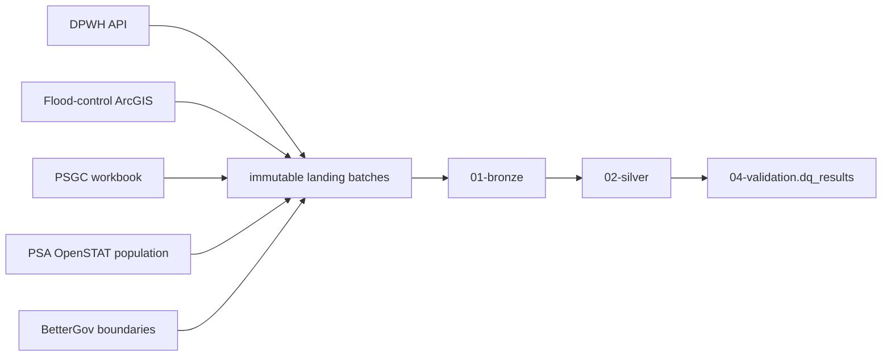

# Buildabida ingestion test repository

A cost-aware, fail-loud pipeline for the Infrastructure Project Monitoring capstone.
It runs from workspace setup through Bronze and stops after validated Silver tables.

## What it builds



The same Python files work in two environments:

- VS Code uses local PySpark and Parquet under `data/tables`.
- Databricks uses the active Spark session and Delta tables in Unity Catalog.

The final production names follow the team decision: catalog
`buildabida-capstone`, then `00-source`, `01-bronze`, `02-silver`,
`03-gold`, and `04-validation` schemas.

## Fast local test

Local Spark needs Python 3.10 or newer and Java 17. On macOS:

```bash
brew install python@3.12 openjdk@17
export JAVA_HOME="$(brew --prefix openjdk@17)/libexec/openjdk.jdk/Contents/Home"
export PATH="$JAVA_HOME/bin:$PATH"

python3.12 -m venv .venv
source .venv/bin/activate
python -m pip install --upgrade pip
python -m pip install -r requirements-local.txt
```

Create the folders:

```bash
python notebooks/00_setup/00_setup_workspace.py
```

Before a full run, place these manually downloaded official files under `data/landing`:

- PSGC 2Q 2026 publication workbook in `data/landing/psgc`.
- BetterGov hierarchical GeoJSON files in `data/landing/boundaries/bettergov`.

The DPWH API, flood-control layer, and PSA OpenSTAT population are downloaded by
the pipeline. Then run a cheap sample:

```bash
BUILDABIDA_RUN_MODE=sample python notebooks/00_run_pipeline.py
```

Sample API tables receive a `_sample` suffix, so they cannot overwrite full tables.
When the sample passes, run the full pipeline:

```bash
python notebooks/00_run_pipeline.py
```

## Databricks

1. Add this repository as a Databricks Git Folder.
2. Attach Serverless compute.
3. Confirm that the Git Folder environment reads `pyproject.toml`. If it does not,
   add `-r requirements-databricks.txt` in the Environment panel.
4. Run `notebooks/00_setup/00_setup_workspace.py` once.
5. Upload the PSGC and boundary files to the paths in [the runbook](docs/runbook.md).
6. Run `notebooks/00_run_pipeline.py`.

If PSA blocks the population request in Databricks, run
`notebooks/01_bronze/04_population.py` locally first, upload `response.json`, and
set the `population_raw_file` widget to its Volume path.

## Why this stays low cost

- One orchestrator reuses one Spark session.
- DPWH requests 5,000 rows per page; ArcGIS requests its 1,000-row maximum.
- API pages are streamed to disk instead of accumulated in one Python list.
- Tables publish once per stage, never row by row.
- Silver business logic stays in Spark SQL; Python handles source ingestion and the
  portable point-in-polygon index.
- Candidates use disk persistence only when reused for validation and writing.
- Spatial matching broadcasts only city and municipality boundaries, with a hard
  maximum of 5,000 features.
- A sample mode validates the pipeline without overwriting production tables.

## Documentation

- [Runbook](docs/runbook.md)
- [Architecture and engineering decisions](docs/architecture.md)
- [Data model](docs/data-model.md)
- [Validation and stop conditions](docs/validation.md)
- [Source cards](docs/sources.md)

## Scope boundary

This repository intentionally stops after Silver. It does not add Gold marts,
dashboard logic, or AI/BI assets.
